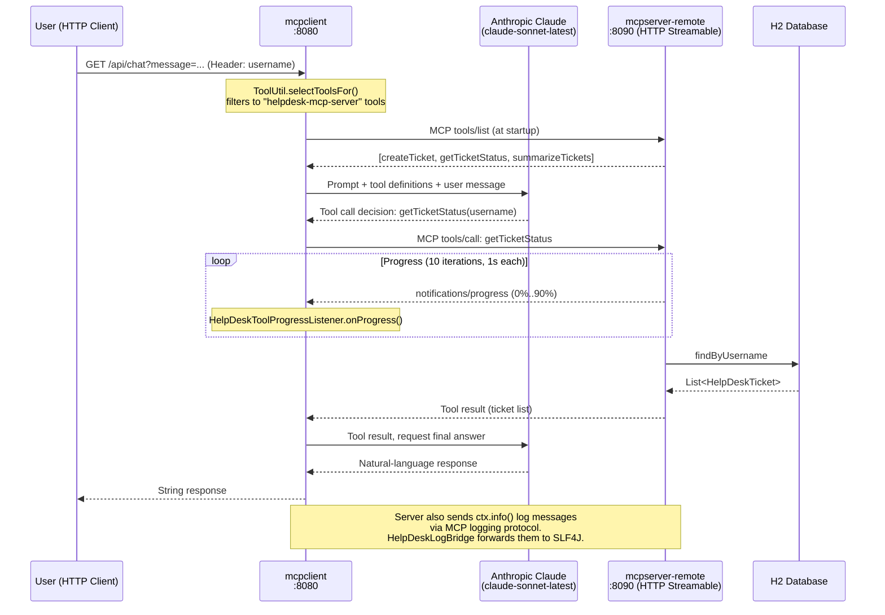
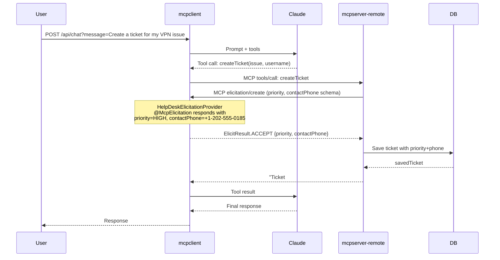
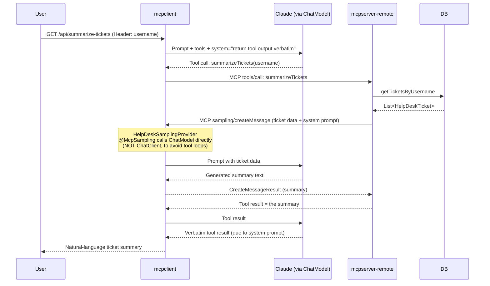

# spring-ai-mcp — Spring AI Model Context Protocol Demo (Help Desk)

A three-module Spring Boot 4 application that demonstrates the **Model Context Protocol (MCP)** using Spring AI 2.0.1. An AI-powered help-desk system shows how an LLM-backed client discovers and invokes tools on dedicated MCP servers using both **HTTP (Streamable)** and **stdio** transports, and covers advanced MCP capabilities: **elicitation**, **sampling**, **progress notifications**, and **server-to-client logging**.

---

## Table of Contents

1. [Overview](#overview)
2. [What is MCP?](#what-is-mcp)
3. [Key Features](#key-features)
4. [Technology Stack](#technology-stack)
5. [Prerequisites](#prerequisites)
6. [Project Modules](#project-modules)
7. [Configuration](#configuration)
8. [Project Structure](#project-structure)
9. [Architecture](#architecture)
10. [MCP Details](#mcp-details)
    - [Server Tools](#server-tools)
    - [Tool Discovery Flow](#tool-discovery-flow)
    - [Tool Invocation Flow](#tool-invocation-flow)
    - [Advanced MCP Features](#advanced-mcp-features)
11. [Detailed Execution Flow](#detailed-execution-flow)
12. [API Documentation](#api-documentation)
13. [Core Components and Classes](#core-components-and-classes)
14. [AI / Spring AI Details](#ai--spring-ai-details)
15. [Running the Application](#running-the-application)
16. [Example Usage](#example-usage)
17. [Testing](#testing)
18. [Error Handling](#error-handling)
19. [Security Considerations](#security-considerations)
20. [Design Decisions](#design-decisions)
21. [Limitations](#limitations)
22. [Possible Improvements](#possible-improvements)
23. [Troubleshooting](#troubleshooting)
24. [Learning Notes / Key Takeaways](#learning-notes--key-takeaways)
25. [Glossary](#glossary)
26. [References](#references)
27. [License](#license)

---

## Overview

This project is a hands-on reference implementation of the **Model Context Protocol** (MCP) spec using the **Spring AI** framework. It models a help-desk scenario:

- Users send natural-language requests to the **mcpclient** REST API.
- An **Anthropic Claude** LLM decides which tool to call (create a ticket, check status, summarize tickets).
- The tool call is routed through MCP to either the **remote HTTP server** (`mcpserver-remote`) or the **stdio server** (`mcpserver-stdio`).
- Tool results flow back to the LLM, which produces the final response.

The remote server additionally showcases three advanced MCP features that go beyond basic tool calls: elicitation (asking the client/user for extra input mid-tool), sampling (asking the client's LLM to generate text on the server's behalf), and progress notifications (streaming execution progress back to the client).

---

## What is MCP?

**Model Context Protocol (MCP)** is an open standard (introduced by Anthropic in 2024) that defines how an AI application (the *host/client*) can securely connect to external data sources and tools (the *servers*) in a structured, model-agnostic way.

### Core Concepts

| Concept | Description |
|---|---|
| **MCP Server** | A process that exposes **Tools**, **Resources**, and/or **Prompts** over a standard protocol. |
| **MCP Client** | The application that connects to one or more servers, discovers capabilities, and calls tools on the LLM's behalf. |
| **Tool** | A callable function with a name, a JSON Schema description of its inputs, and a return value. The LLM reads the descriptions and decides when to call them. |
| **Resource** | A readable piece of content (e.g., a file, a database row) the server can expose. Not used in this project. |
| **Prompt** | A reusable prompt template the server can offer. Not used in this project. |
| **Transport** | The communication channel. MCP supports **stdio** (process stdin/stdout) and **HTTP Streamable** (SSE over HTTP). |
| **Elicitation** | A server asking the client to collect extra input from a human user mid-tool-call. |
| **Sampling** | A server asking the client's LLM to generate text on the server's behalf (LLM-as-a-service-for-server). |
| **Progress** | Streaming incremental progress notifications from server to client during a long-running tool call. |
| **Logging** | Structured log messages sent from a server to a client for visibility. |

### Why Use MCP Instead of Regular REST Tool Calls?

| Concern | REST Tool Call | MCP Tool Call |
|---|---|---|
| Discovery | Static — developer hardcodes tool definitions | Dynamic — client calls `tools/list` at runtime |
| Transport flexibility | One URL per tool | Server can use stdio, SSE, or HTTP |
| Elicitation | Not supported | Built into spec |
| Sampling | Not supported | Built into spec |
| Progress streaming | Ad-hoc SSE needed | First-class `notifications/progress` |
| Multi-server aggregation | Manual | Client connects to N servers, merges tool lists |
| Reusability | LLM client must know REST contract | Any MCP-capable LLM client works |

---

## Key Features

- Two MCP transports demonstrated side-by-side: **HTTP Streamable** and **stdio**
- Three help-desk tools: **createTicket**, **getTicketStatus**, **summarizeTickets**
- **MCP Elicitation**: server pauses tool execution to ask the client to collect priority and phone number from the user
- **MCP Sampling**: server delegates LLM text generation to the client's Claude model (the server has no API key of its own)
- **MCP Progress**: server streams 10 progress notifications (0%–90%) to the client during ticket fetch
- **MCP Logging**: server sends structured log messages to the client via `ctx.info()`
- **Per-request tool selection** via `ToolUtil.selectToolsFor()` (filter by server name and/or tool name)
- **Global tool filtering** via `MCPServerToolFilter` implementing `McpToolFilter` (blocks GitHub tools and `write_` tools)
- Persistent H2 file database in both servers for ticket storage
- Anthropic Claude (`claude-sonnet-latest`) as the AI model

---

## Technology Stack

| Layer | Technology | Version |
|---|---|---|
| Language | Java | 17 |
| Framework | Spring Boot | 4.1.1 |
| AI Framework | Spring AI | 2.0.1 |
| MCP Client Starter | spring-ai-starter-mcp-client | (managed by spring-ai-bom 2.0.1) |
| MCP Server Starter (HTTP) | spring-ai-starter-mcp-server-webmvc | (managed by spring-ai-bom 2.0.1) |
| MCP Server Starter (stdio) | spring-ai-starter-mcp-server | (managed by spring-ai-bom 2.0.1) |
| AI Model Provider | Anthropic Claude | claude-sonnet-latest |
| Spring AI Anthropic Starter | spring-ai-starter-model-anthropic | (managed by spring-ai-bom 2.0.1) |
| Database | H2 (file mode) | (managed by Spring Boot) |
| ORM | Spring Data JPA + Hibernate | (managed by Spring Boot) |
| Web Layer | Spring MVC (spring-boot-starter-webmvc) | (managed by Spring Boot) |
| Build | Maven | 3.x (Maven Wrapper included) |
| Utilities | Lombok | (managed by Spring Boot) |
| MCP SDK | io.modelcontextprotocol (MCP Java SDK) | (transitively via Spring AI) |

---

## Prerequisites

- **Java 17** or later
- **Maven 3.8+** (or use the `mvnw` / `mvnw.cmd` wrapper in each module)
- **Node.js + npx** — required only if you want to run the `@modelcontextprotocol/server-filesystem` stdio server referenced in the JSON config files
- An **Anthropic API key** — set in the environment as `ANTHROPIC_API_KEY` (obtain from [console.anthropic.com](https://console.anthropic.com))
- No Docker or Docker Compose files are present in the repository; everything runs as plain JVM processes.

---

## Project Modules

This repository contains **three independent Spring Boot projects** (not a parent POM multi-module). Each has its own `pom.xml` and Maven wrapper. They share no compile-time dependency; they only communicate at runtime via MCP.

### `mcpserver-stdio`

| Property | Value |
|---|---|
| Artifact | `mcpserver-stdio` |
| Group | `com.springai` |
| Transport | **stdio** (MCP messages over stdin/stdout) |
| Web server | None (`spring.main.web-application-type=none`) |
| Port | N/A |
| Database | H2 file at `C:/Users/C5417797/Desktop/JavaCoding/Springboot/MCP-Server-H2-DB/chat-memory` |
| Logging | All logging disabled (`logging.level.root=OFF`); logs to file instead |
| Tools | `createTicket`, `getTicketStatus` |
| Advanced MCP | None (basic tool calls only) |

Why logging is disabled: the stdio transport uses stdin/stdout to carry MCP JSON messages. Any text written to stdout (e.g., a log line) would corrupt the JSON stream and break the protocol. Logs are redirected to a file.

### `mcpserver-remote`

| Property | Value |
|---|---|
| Artifact | `mcpserver-remote` |
| Group | `com.springai` |
| Transport | **HTTP Streamable** (SSE over HTTP) |
| Web server | Spring MVC |
| Port | `8090` |
| MCP endpoint | `/mcp` |
| MCP server name | `helpdesk-mcp-server` |
| Database | H2 file at `~/mcp-chat-memory` |
| Tools | `createTicket`, `getTicketStatus`, `summarizeTickets` |
| Advanced MCP | Elicitation, Sampling, Progress, Logging |

This is the more feature-complete server. The remote transport allows both sides to be long-running processes and supports bidirectional messages (server-to-client progress, logging, sampling, elicitation) over HTTP SSE.

### `mcpclient`

| Property | Value |
|---|---|
| Artifact | `mcpclient` |
| Group | `com.springai` |
| Port | `8080` (default) |
| AI model | Anthropic Claude (`claude-sonnet-latest`) |
| MCP connections | 1x HTTP Streamable to `mcpserver-remote`, 1x stdio to filesystem server |
| REST endpoints | `GET /api/chat`, `GET /api/summarize-tickets` |

The client is the user-facing application. It accepts HTTP requests, builds a prompt, invokes Claude with the appropriate MCP tool callbacks, and returns the AI's final answer.

---

## Configuration

### `mcpclient/src/main/resources/application.properties`

```properties
spring.application.name=mcpclient

# Anthropic API key from environment variable
spring.ai.anthropic.api-key=${ANTHROPIC_API_KEY}

spring.ai.anthropic.base-url=https://api.anthropic.com

spring.ai.anthropic.chat.options.model=claude-sonnet-latest

# Log the full advisor chain (prompt + response) at DEBUG
logging.level.org.springframework.ai.chat.client.advisor=DEBUG

# Which stdio MCP servers to start (currently only the filesystem server)
spring.ai.mcp.client.stdio.servers-configuration=classpath:mcp-servers-mcpremote.json

# How long to wait for an MCP tool call response
spring.ai.mcp.client.request-timeout=60s

# HTTP Streamable connection to mcpserver-remote
spring.ai.mcp.client.streamable-http.connections.mcp-remote.url=http://localhost:8090
spring.ai.mcp.client.streamable-http.connections.mcp-remote.endpoint=/mcp
```

The connection name `mcp-remote` in the last two lines is used as the `clients` attribute value in `@McpElicitation`, `@McpSampling`, `@McpLogging`, and `@McpProgress` annotations in the client utility classes — it must match exactly.

### `mcpclient/src/main/resources/mcp-servers-mcpremote.json`

This file configures stdio MCP servers. In the current `application.properties` this is the active stdio config. It contains only the filesystem server:

```json
{
  "mcpServers": {
    "filesystem": {
      "command": "C:\\Program Files\\nodejs\\npx.cmd",
      "args": ["-y", "@modelcontextprotocol/server-filesystem",
               "C:\\Users\\C5417797\\Desktop\\JavaCoding\\Springboot\\MCP"]
    }
  }
}
```

Update the paths to match your local environment before running.

### `mcpclient/src/main/resources/mcp-servers.json` (alternative full config)

A more complete alternate config that also connects to the stdio version of `mcpserver-stdio` and optionally to a GitHub MCP server. Not currently active in `application.properties` but shows what a full multi-server stdio setup looks like.

### `mcpserver-remote/src/main/resources/application.properties`

```properties
spring.application.name=mcpserver-remote
server.port=8090

# H2 persistent database
spring.datasource.url=jdbc:h2:file:~/mcp-chat-memory
spring.datasource.driver-class-name=org.h2.Driver
spring.datasource.username=Hemanth
spring.datasource.password=12345
spring.h2.console.enabled=true
spring.h2.console.path=/h2-console
spring.jpa.hibernate.ddl-auto=update
spring.jpa.database-platform=org.hibernate.dialect.H2Dialect

# Use HTTP Streamable transport (SSE over HTTP)
spring.ai.mcp.server.protocol=STREAMABLE

# Name the server uses to identify itself during MCP handshake
spring.ai.mcp.server.name=helpdesk-mcp-server
```

### `mcpserver-stdio/src/main/resources/application.properties`

```properties
spring.application.name=mcpserver-stdio

# H2 persistent database (absolute path required because there is no web server)
spring.datasource.url=jdbc:h2:file:C:/Users/C5417797/Desktop/JavaCoding/Springboot/MCP-Server-H2-DB/chat-memory
spring.datasource.driver-class-name=org.h2.Driver
spring.datasource.username=Hemanth
spring.datasource.password=12345
spring.h2.console.enabled=false
spring.jpa.hibernate.ddl-auto=update
spring.jpa.database-platform=org.hibernate.dialect.H2Dialect

# CRITICAL: no web server — MCP communicates via stdin/stdout
spring.main.web-application-type=none

# CRITICAL: disable all logging to stdout to avoid corrupting the stdio stream
logging.level.root=OFF
spring.main.banner-mode=off

# Redirect logs to a file instead
logging.file.name=C:/Users/C5417797/Desktop/JavaCoding/Springboot/MCP-Server-H2-DB/mcpserver-stdio.log
```

### Environment Variables

| Variable | Required By | Description |
|---|---|---|
| `ANTHROPIC_API_KEY` | `mcpclient` | Anthropic API key |

---

## Project Structure

```
spring-ai-mcp/
│
├── .gitignore                                    # Root .gitignore
│
├── mcpclient/                                    # MCP Client + REST API
│   ├── pom.xml
│   ├── mvnw / mvnw.cmd
│   └── src/main/
│       ├── java/com/springai/mcpclient/
│       │   ├── McpclientApplication.java         # Spring Boot entry point
│       │   ├── controller/
│       │   │   └── MCPClientController.java      # REST endpoints /api/chat and /api/summarize-tickets
│       │   └── util/
│       │       ├── HelpDeskElicitationProvider.java  # Handles MCP elicitation callbacks
│       │       ├── HelpDeskLogBridge.java            # Bridges MCP server logs to SLF4J
│       │       ├── HelpDeskSamplingProvider.java     # Handles MCP sampling callbacks
│       │       ├── HelpDeskToolProgressListener.java # Handles MCP progress notifications
│       │       ├── MCPServerToolFilter.java          # Global tool filter (blocks GitHub + write_)
│       │       └── ToolUtil.java                     # Per-request tool selection helper
│       └── resources/
│           ├── application.properties
│           ├── mcp-servers.json                  # Full stdio server config (reference)
│           ├── mcp-servers-mcpremote.json        # Active stdio config (filesystem only)
│           └── mcp-servers-mcpstdio.json         # Stdio config with stdio MCP server
│
├── mcpserver-remote/                             # MCP Server — HTTP Streamable transport
│   ├── pom.xml
│   ├── mvnw / mvnw.cmd
│   └── src/main/
│       ├── java/com/springai/mcpserverremote/
│       │   ├── McpserverRemoteApplication.java   # Spring Boot entry point
│       │   ├── entity/
│       │   │   └── HelpDeskTicket.java           # JPA entity (id, username, issue, status,
│       │   │                                     #   priority, contactPhone, createdAt, eta)
│       │   ├── model/
│       │   │   ├── TicketRequest.java            # Record: issue, username
│       │   │   └── TicketContactInfo.java        # Record: priority, contactPhone (elicitation schema)
│       │   ├── repository/
│       │   │   └── HelpDeskTicketRepository.java # JPA repo with findByUsername
│       │   ├── service/
│       │   │   └── HelpDeskTicketService.java    # Ticket CRUD logic
│       │   └── tools/
│       │       └── HelpDeskTools.java            # @McpTool-annotated methods (the 3 tools)
│       └── resources/
│           └── application.properties
│
└── mcpserver-stdio/                              # MCP Server — stdio transport
    ├── pom.xml
    ├── mvnw / mvnw.cmd
    └── src/main/
        ├── java/com/springai/mcpserverremote/   # NOTE: same package name as remote (historical)
        │   ├── McpserverStdioApplication.java   # Spring Boot entry point
        │   ├── entity/
        │   │   └── HelpDeskTicket.java          # JPA entity (simpler: no priority/contactPhone)
        │   ├── model/
        │   │   └── TicketRequest.java           # Record: issue, username
        │   ├── repository/
        │   │   └── HelpDeskTicketRepository.java
        │   ├── service/
        │   │   └── HelpDeskTicketService.java
        │   └── tools/
        │       └── HelpDeskTools.java           # Only createTicket + getTicketStatus (no ctx)
        └── resources/
            └── application.properties
```

---

## Architecture



### Elicitation Flow (createTicket)



### Sampling Flow (summarizeTickets)



---

## MCP Details

### Server Tools

Both servers expose some or all of the following tools. The remote server's versions are more advanced.

#### `createTicket`

| Attribute | Value |
|---|---|
| Name | `createTicket` |
| Description | "Create the Support Ticket" |
| Input | `TicketRequest` record: `{issue: String, username: String}` |
| Output | String — e.g., "Ticket #1 created successfully for user john with priority HIGH (contact phone: +1-202-555-0185)." |
| Available on | `mcpserver-remote`, `mcpserver-stdio` |
| Advanced features | **Elicitation** (remote only): pauses to ask client for `priority` and `contactPhone` |

Execution (remote server):
1. Receives `TicketRequest` from the MCP framework (deserialized from JSON).
2. Checks if elicitation is supported by the client (`ctx.elicitEnabled()`).
3. If yes, calls `ctx.elicit()` with the `TicketContactInfo` class as schema — Spring AI generates the JSON Schema from the record fields.
4. Receives the client's `ElicitResult`. If `ACCEPT`, extracts `priority` and `contactPhone`.
5. Calls `helpDeskTicketService.createTicket(ticketRequest, priority, contactPhone)`.
6. Returns a confirmation string.

#### `getTicketStatus`

| Attribute | Value |
|---|---|
| Name | `getTicketStatus` |
| Description | "Fetch the status of the tickets based on a given username" |
| Input | `username: String` |
| Output | `List<HelpDeskTicket>` (serialized to JSON array) |
| Available on | `mcpserver-remote`, `mcpserver-stdio` |
| Advanced features | **Progress notifications** + **MCP Logging** (remote only) |

Execution (remote server):
1. Logs and sends `ctx.info()` (server-to-client log message).
2. Calls `helpDeskTicketService.getTicketsByUsername(username)`.
3. Loops 10 times with `Thread.sleep(1000)`, calling `ctx.progress()` each iteration (0%–90%).
4. Returns the ticket list.

Note: The 10-second sleep is intentional — it simulates a slow operation and demonstrates the progress API. In production, remove the sleep.

#### `summarizeTickets`

| Attribute | Value |
|---|---|
| Name | `summarizeTickets` |
| Description | "Generate a friendly, natural-language summary of all the support tickets that belong to a given username" |
| Input | `username: String` |
| Output | String — LLM-generated natural-language summary |
| Available on | `mcpserver-remote` only |
| Advanced features | **MCP Sampling** |

Execution:
1. Fetches tickets from DB.
2. Checks `ctx.sampleEnabled()` — if not supported, falls back to returning raw ticket data.
3. Builds a system prompt and formats the ticket data.
4. Calls `ctx.sample()` — this sends a `sampling/createMessage` request back to the client.
5. The client's `HelpDeskSamplingProvider` receives the sampling request, runs it through `ChatModel` (not `ChatClient`), and returns the completion.
6. The server extracts the text from `CreateMessageResult` and returns it as the tool result.

### Tool Discovery Flow

1. At application startup, Spring AI auto-configures `McpSyncClient` beans for each connection.
2. For each HTTP Streamable connection (e.g., `mcp-remote`), the client sends an `initialize` request to the server. The server responds with its capabilities and `serverInfo` (name: `helpdesk-mcp-server`).
3. The client also starts any stdio servers defined in the JSON config files as child processes.
4. Spring AI registers all discovered tools as `ToolCallback` beans (or they can be retrieved on demand via `McpSyncClient.listTools()`).
5. The global `MCPServerToolFilter` is consulted for each tool during auto-registration. Tools from a server whose name contains "github" are blocked; tools whose name contains "write_" are blocked.
6. When `MCPClientController` handles a request, `ToolUtil.selectToolsFor()` does a second, per-request filter — it keeps only tools from the server named "helpdesk-mcp-server" (by substring match on the server name).

### Tool Invocation Flow

1. The controller calls `chatClient.prompt().user(message).tools(toolCallbacks).call().content()`.
2. Spring AI sends the prompt and the tool schemas (JSON Schema generated from parameter types/annotations) to Claude.
3. Claude responds with a `tool_use` message naming the tool and providing arguments.
4. Spring AI's tool-calling loop serializes the arguments to JSON, passes them to the matching `ToolCallback` (a `SyncMcpToolCallback`).
5. `SyncMcpToolCallback` calls `McpSyncClient.callTool()` which sends a `tools/call` MCP message to the server.
6. The server deserializes the JSON arguments into Java types (e.g., `TicketRequest`), executes the method, and serializes the return value.
7. The result flows back to Spring AI, which appends it as a tool result to the conversation.
8. Claude generates a final natural-language response incorporating the tool result.

### Advanced MCP Features

#### Elicitation

Elicitation is an MCP mechanism where a **server** asks a **client** to collect structured input from a human user mid-tool-execution.

In this project:
- The `createTicket` tool in `mcpserver-remote` calls `ctx.elicit(spec, TicketContactInfo.class)` when a client announces elicitation capability.
- Spring AI generates a JSON Schema from the `TicketContactInfo` record (`priority: String`, `contactPhone: String`) and sends it in the `elicitation/create` request.
- The client-side `HelpDeskElicitationProvider` (annotated `@McpElicitation(clients = "mcp-remote")`) receives the request, simulates a human filling the form, and returns `ElicitResult.ACCEPT` with the data.
- The `clients = "mcp-remote"` must match the connection name in `application.properties`.

In a real UI-backed application, the elicitation handler would display a form to the user and return their input.

#### Sampling

Sampling is an MCP mechanism where a **server** asks a **client** to run an LLM completion on the server's behalf. This gives the server access to an LLM without needing its own API key.

In this project:
- `summarizeTickets` in `mcpserver-remote` calls `ctx.sample()` with a system prompt and ticket data.
- `HelpDeskSamplingProvider` (annotated `@McpSampling(clients = "mcp-remote")`) receives `McpSchema.CreateMessageRequest`, builds a Spring AI `Prompt`, and calls `chatModel.call()`.
- **Critical design point**: it injects `ChatModel` directly, NOT `ChatClient`. A `ChatClient` in this application is wired with MCP tool callbacks. Using it inside a sampling handler could trigger another tool call that issues another sampling request — an infinite loop. Using the raw `ChatModel` bypasses tool callbacks entirely.

#### Progress Notifications

The `getTicketStatus` tool in `mcpserver-remote` sends progress notifications every second:
```java
ctx.progress(spec -> spec.progress(percent).message("Fetching tickets..."));
```
The client-side `HelpDeskToolProgressListener` (annotated `@McpProgress(clients = "mcp-remote")`) logs each notification. The `progressToken` is set by the controller in the `toolContext` map:
```java
.toolContext(Map.of("progressToken", UUID.randomUUID().toString()))
```

#### MCP Logging (Server-to-Client)

The server calls `ctx.info("message")` to send structured log messages. `HelpDeskLogBridge` (annotated `@McpLogging(clients = "mcp-remote")`) bridges these to SLF4J on the client side.

---

## Detailed Execution Flow

### `GET /api/chat?message=check+my+tickets` with `username: john`

1. `MCPClientController.chat()` receives the request.
2. `ToolUtil.selectToolsFor(mcpSyncClients, "helpdesk-mcp-server", null)` iterates all `McpSyncClient` instances, calls `client.listTools()` on each, and builds `SyncMcpToolCallback[]` for tools from the server named `helpdesk-mcp-server`.
3. `chatClient.prompt().user("check my tickets My username is john").tools(toolCallbacks).toolContext(...).call()` is invoked.
4. Spring AI sends a messages array to Claude including: system (none), user message, and tool definitions for `createTicket`, `getTicketStatus`, `summarizeTickets`.
5. Claude responds with a `tool_use` block: `{name: "getTicketStatus", input: {username: "john"}}`.
6. Spring AI deserializes the input and calls `SyncMcpToolCallback.call()` for `getTicketStatus`.
7. `SyncMcpToolCallback` calls `mcpSyncClient.callTool(toolName, arguments)`.
8. The call is sent over the HTTP Streamable connection to `mcpserver-remote` at `http://localhost:8090/mcp`.
9. `HelpDeskTools.getTicketStatus("john", ctx)` executes in `mcpserver-remote`:
   - `ctx.info(...)` sends log message -> `HelpDeskLogBridge.onServerLog()` on client
   - DB query runs; tickets are found
   - Loop sends 10 progress notifications -> `HelpDeskToolProgressListener.onProgress()` on client
10. `getTicketStatus` returns `List<HelpDeskTicket>` serialized as JSON.
11. MCP tool result flows back to `MCPClientController`.
12. Spring AI appends the tool result to the conversation and sends it back to Claude.
13. Claude generates a natural-language response: "You have 2 open tickets: ..."
14. Controller returns the string to the HTTP client.

---

## API Documentation

### `GET /api/chat`

Chat with the help-desk AI. The AI decides which tool(s) to call based on the message.

| Parameter | Location | Required | Description |
|---|---|---|---|
| `message` | Query param | Yes | Natural language request |
| `username` | Request header | No | Username to pass to the AI for context |

**Example request:**
```
GET http://localhost:8080/api/chat?message=create+a+ticket+for+VPN+not+working
username: john
```

**Example response:**
```
Ticket #3 created successfully for user john with priority HIGH (contact phone: +1-202-555-0185).
```

### `GET /api/summarize-tickets`

Summarize all tickets for a user. Internally uses the `summarizeTickets` tool which leverages MCP Sampling.

| Parameter | Location | Required | Description |
|---|---|---|---|
| `username` | Request header | Yes | Username whose tickets to summarize |

**Example request:**
```
GET http://localhost:8080/api/summarize-tickets
username: john
```

**Example response:**
```
Hi John! You currently have 3 support tickets with our team. One ticket (#1) is OPEN regarding your VPN issue,
one ticket (#2) is IN_PROGRESS for the printer problem (our team is actively working on it), and one ticket
(#3) has been CLOSED for the email setup request. We'll keep you updated on the open items!
```

### H2 Console (mcpserver-remote only)

```
http://localhost:8090/h2-console
JDBC URL: jdbc:h2:file:~/mcp-chat-memory
Username: Hemanth
Password: 12345
```

---

## Core Components and Classes

### mcpclient

#### `MCPClientController`
- Package: `com.springai.mcpclient.controller`
- Responsibilities: Expose REST endpoints; build `ChatClient` with `SimpleLoggerAdvisor`; delegate to `ToolUtil` for per-request tool selection; set `toolContext` for progress tracking.
- Notable: The `ToolCallbackProvider` is commented out — the author switched from the global provider to per-request selection via `ToolUtil`. This gives finer control over which tools the AI can call.

#### `ToolUtil`
- Package: `com.springai.mcpclient.util`
- Responsibilities: Static helper that iterates `McpSyncClient` instances, calls `listTools()`, and returns `SyncMcpToolCallback` arrays filtered by server name and/or tool name.
- Key method: `selectToolsFor(List<McpSyncClient>, String serverName, String toolName)`.

#### `MCPServerToolFilter`
- Package: `com.springai.mcpclient.util`
- Implements: `McpToolFilter` (Spring AI interface)
- Responsibilities: Global filter applied at tool-discovery time. Blocks all tools from servers whose name contains "github". Blocks any tool whose name contains "write_".
- This runs once when Spring AI builds the global tool list, not per-request.

#### `HelpDeskElicitationProvider`
- Package: `com.springai.mcpclient.util`
- Annotation: `@McpElicitation(clients = "mcp-remote")`
- Responsibilities: Receive `McpSchema.ElicitRequest` from the server, simulate human input, return `ElicitResult.ACCEPT` with `priority=HIGH` and `contactPhone=+1-202-555-0185`.

#### `HelpDeskSamplingProvider`
- Package: `com.springai.mcpclient.util`
- Annotation: `@McpSampling(clients = "mcp-remote")`
- Injects: `ChatModel` (not `ChatClient`)
- Responsibilities: Receive `McpSchema.CreateMessageRequest`, translate to Spring AI `Prompt`, call `chatModel.call()`, return `CreateMessageResult`.

#### `HelpDeskToolProgressListener`
- Package: `com.springai.mcpclient.util`
- Annotation: `@McpProgress(clients = "mcp-remote")`
- Responsibilities: Receive `McpSchema.ProgressNotification`, log progress percentage and message.

#### `HelpDeskLogBridge`
- Package: `com.springai.mcpclient.util`
- Annotation: `@McpLogging(clients = "mcp-remote")`
- Responsibilities: Receive structured log messages from the server, forward to SLF4J.

### mcpserver-remote

#### `HelpDeskTools`
- Package: `com.springai.mcpserverremote.tools`
- Annotations: `@Component`, `@RequiredArgsConstructor`
- Tools: `createTicket` (with elicitation), `getTicketStatus` (with progress + logging), `summarizeTickets` (with sampling).
- Key dependency: `HelpDeskTicketService`, `McpSyncRequestContext ctx` (injected by MCP framework per call).

#### `HelpDeskTicket` (entity)
- Package: `com.springai.mcpserverremote.entity`
- Fields: `id`, `username`, `issue`, `status`, `priority`, `contactPhone`, `createdAt`, `eta`
- Table: `helpdesk_tickets`
- Note: `priority` and `contactPhone` are only present in `mcpserver-remote`. The `mcpserver-stdio` version does not have these fields.

#### `TicketContactInfo` (record)
- Package: `com.springai.mcpserverremote.model`
- Fields: `priority: String`, `contactPhone: String`
- Purpose: The Java type whose structure is used to auto-generate the JSON Schema for the MCP elicitation request.

#### `TicketRequest` (record)
- Package: `com.springai.mcpserverremote.model`
- Fields: `issue: String`, `username: String`
- Purpose: Input to `createTicket` tool. Spring AI deserializes the LLM's tool arguments into this type.

### mcpserver-stdio

The stdio server is a simplified version of the remote server. Key differences:
- No `TicketContactInfo`, no `priority`/`contactPhone` fields on `HelpDeskTicket`.
- `HelpDeskTools` has only `createTicket` and `getTicketStatus`, both without `McpSyncRequestContext` — no elicitation, no sampling, no progress, no server logging.
- `HelpDeskTicketService.createTicket()` takes only `TicketRequest` (no priority/phone).

---

## AI / Spring AI Details

### Model Configuration

| Setting | Value |
|---|---|
| Provider | Anthropic |
| Model | `claude-sonnet-latest` |
| API key source | `${ANTHROPIC_API_KEY}` environment variable |
| Base URL | `https://api.anthropic.com` |

### How Spring AI Integrates with MCP

`spring-ai-starter-mcp-client` auto-configures:
- `McpSyncClient` beans for each connection (one per HTTP endpoint, one per stdio process).
- A `ToolCallbackProvider` bean that aggregates all tools from all connected servers.
- Registration hooks that apply `McpToolFilter` implementations.

The `ChatClient` is the high-level API. It accepts `ToolCallback[]` via `.tools(...)`. When Claude returns a tool_use response, Spring AI's internal loop calls the matching callback, gets the result, appends it to the message history, and re-submits to Claude.

`SimpleLoggerAdvisor` is registered as a default advisor — it logs the full prompt and response at `DEBUG` level (controlled by `logging.level.org.springframework.ai.chat.client.advisor=DEBUG`).

### Why `ChatModel` vs `ChatClient` in Sampling

`ChatClient` = `ChatModel` + tool callbacks + advisors.
In `HelpDeskSamplingProvider`, if `ChatClient` was used, it would include the MCP tool callbacks. Claude inside the sampling call could then decide to call `summarizeTickets` again, which would trigger another sampling request — infinite recursion. By injecting `ChatModel` directly, the sampling call is a plain LLM completion with no tool loops.

---

## Running the Application

### Order Matters

The MCP client tries to connect to the remote server at startup. Start servers before the client.

### Step 1: Start `mcpserver-remote`

```bash
cd mcpserver-remote
./mvnw spring-boot:run
```

Or build and run the JAR:
```bash
./mvnw clean package -DskipTests
java -jar target/mcpserver-remote-0.0.1-SNAPSHOT.jar
```

Verify: `http://localhost:8090/h2-console` should be accessible.

### Step 2: Start `mcpclient`

```bash
cd mcpclient
export ANTHROPIC_API_KEY=your_anthropic_api_key_here
./mvnw spring-boot:run
```

On Windows PowerShell:
```powershell
$env:ANTHROPIC_API_KEY = "your_anthropic_api_key_here"
.\mvnw.cmd spring-boot:run
```

At startup, the client will:
1. Launch any configured stdio servers (the filesystem server if `mcp-servers-mcpremote.json` is configured).
2. Connect via HTTP Streamable to `mcpserver-remote` at `http://localhost:8090/mcp`.
3. Run `initialize` handshake and `tools/list` to discover available tools.
4. Apply `MCPServerToolFilter` to the discovered tools.

Verify: `http://localhost:8080/api/chat?message=hello` should return a response.

### Step 3 (Optional): Run `mcpserver-stdio` as a standalone process

The stdio server is normally launched as a child process by the MCP client based on the JSON config. To test it standalone, first build its JAR:

```bash
cd mcpserver-stdio
./mvnw clean package -DskipTests
```

Then update `mcp-servers.json` (or `mcp-servers-mcpstdio.json`) to point to the JAR path and set `spring.ai.mcp.client.stdio.servers-configuration` to use that file. Restart the client.

**Important**: Update the absolute paths in all JSON config files and `application.properties` files to match your local environment before running.

---

## Example Usage

### Create a Ticket (demonstrates Elicitation)

```bash
curl -X GET "http://localhost:8080/api/chat?message=My+VPN+is+not+working+please+create+a+ticket" \
  -H "username: john"
```

Internally:
1. Claude calls `createTicket({issue: "VPN not working", username: "john"})`
2. Server sends elicitation request asking for priority and phone
3. `HelpDeskElicitationProvider` responds with `priority=HIGH, contactPhone=+1-202-555-0185`
4. Ticket is saved with these values
5. Response: "Ticket #1 created successfully for user john with priority HIGH (contact phone: +1-202-555-0185)."

### Check Ticket Status (demonstrates Progress)

```bash
curl -X GET "http://localhost:8080/api/chat?message=What+are+the+statuses+of+my+tickets" \
  -H "username: john"
```

Internally:
1. Claude calls `getTicketStatus({username: "john"})`
2. Server sends progress 0% → 10% → ... → 90% over 10 seconds (1s intervals)
3. Client logs each progress notification
4. Server returns ticket list
5. Claude formats into a natural-language response

### Summarize Tickets (demonstrates Sampling)

```bash
curl -X GET "http://localhost:8080/api/summarize-tickets" \
  -H "username: john"
```

Internally:
1. Claude calls `summarizeTickets({username: "john"})`
2. Server fetches tickets, requests LLM sampling from client
3. Client's `HelpDeskSamplingProvider` calls `ChatModel` with ticket data + system prompt
4. Claude generates a friendly summary
5. Summary flows back through MCP to the tool result
6. The controller's system prompt instructs Claude to return the tool result verbatim

---

## Testing

Both `mcpclient` and `mcpserver-remote` (and `mcpserver-stdio`) contain only a single boilerplate Spring Boot context-load test:

```java
@SpringBootTest
class McpclientApplicationTests {
    @Test
    void contextLoads() {
    }
}
```

**There are no integration tests, unit tests for tools, or mocked MCP tests.** The `contextLoads()` test will likely fail in a CI environment because:
- `mcpclient` requires `ANTHROPIC_API_KEY` to be set and a running MCP server.
- `mcpserver-remote` requires H2 database path to exist.

To run the context load test successfully you would need to:
1. Set `ANTHROPIC_API_KEY`
2. Have `mcpserver-remote` running (for the client test)
3. Or mock/disable MCP connections in test configuration

---

## Error Handling

The codebase does not include explicit global exception handling (no `@ControllerAdvice`). Error handling observed in the code:

| Scenario | Handling |
|---|---|
| Sampling returns null result | `HelpDeskSamplingProvider` throws `IllegalStateException` |
| Elicitation `DECLINE` or `CANCEL` | `createTicket` falls back to default priority (`MEDIUM`) and no phone |
| Client does not support elicitation | `createTicket` logs a warning, proceeds with defaults |
| Client does not support sampling | `summarizeTickets` returns raw ticket data as a string |
| MCP server unreachable at startup | Spring Boot startup will fail (no retry logic) |
| Tool call timeout | Controlled by `spring.ai.mcp.client.request-timeout=60s` |

---

## Security Considerations

- **API Key**: `ANTHROPIC_API_KEY` is read from an environment variable, not hardcoded. The `.gitignore` includes `.env` files.
- **H2 Credentials**: The database username (`Hemanth`) and password (`12345`) are hardcoded in `application.properties`. These are development credentials and **must** be externalized for any non-local deployment.
- **H2 Console**: Enabled in `mcpserver-remote` (`spring.h2.console.enabled=true`). This exposes the database over HTTP and must be disabled in production.
- **No authentication on REST endpoints**: `GET /api/chat` and `GET /api/summarize-tickets` are unauthenticated. The `username` header is passed by the caller without any validation.
- **Tool filtering**: `MCPServerToolFilter` blocks GitHub tools and `write_` tools — a defense-in-depth measure to prevent unintended tool exposure. The filter uses hard-coded string matching; a production system should drive this from configuration.
- **Path disclosure**: The JSON config files and `application.properties` files contain absolute local paths (e.g., `C:\Users\C5417797\...`). These are committed to the repository. Update before sharing publicly.
- **No HTTPS**: All communication is over plain HTTP (client ↔ MCP server). Use the direct Anthropic API (`https://api.anthropic.com`) which is already TLS-encrypted.

---

## Design Decisions

1. **Three independent modules instead of a parent POM multi-module**: Each module can be developed, deployed, and versioned independently. The tradeoff is no shared code; the entity classes are duplicated between `mcpserver-remote` and `mcpserver-stdio`.

2. **stdio server package name reuse**: `mcpserver-stdio` uses the package `com.springai.mcpserverremote` (the same as the remote server). This appears to be a copy-paste from the remote server. It works but is confusing — a proper package name would be `com.springai.mcpserverstdio`.

3. **Per-request tool selection via `ToolUtil`**: The global `ToolCallbackProvider` auto-registration is commented out in favor of `ToolUtil.selectToolsFor()` in each controller method. This gives the developer explicit control over which tools are visible to the LLM per endpoint. The tradeoff is that the tool list is fetched from the server on every request (via `client.listTools()`), which adds latency.

4. **`ChatModel` in sampling handler**: An explicit design decision to avoid infinite tool-call loops. See "AI / Spring AI Details" section.

5. **Elicitation hardcoded response**: `HelpDeskElicitationProvider` always responds with `priority=HIGH, contactPhone=+1-202-555-0185`. This is a simulation. In a real application, this handler would interact with a UI to collect real user input.

6. **10-second progress simulation in `getTicketStatus`**: The `Thread.sleep(1000)` loop is intentional for demo purposes. It makes the progress feature visible. Remove or replace with real operation progress in production.

7. **`summarize-tickets` endpoint system prompt**: The controller tells Claude to return the tool output verbatim. This prevents Claude from reformatting or adding commentary to the sampling-generated summary.

---

## Limitations

1. **No shared parent POM**: Dependency versions are duplicated across three `pom.xml` files. If Spring AI or Spring Boot version needs updating, all three must be changed.

2. **Entity duplication**: `HelpDeskTicket`, `HelpDeskTicketService`, `HelpDeskTicketRepository`, and `TicketRequest` are duplicated between `mcpserver-remote` and `mcpserver-stdio`. The stdio version has a simpler entity (no `priority`, `contactPhone`).

3. **Hardcoded elicitation response**: `HelpDeskElicitationProvider` always returns the same mock response. Real user interaction is not implemented.

4. **Progress simulation only**: The `getTicketStatus` tool sleeps 10 seconds regardless of actual database query time.

5. **No authentication or authorization**: Any caller can access any user's tickets by supplying a username header.

6. **Absolute paths in config**: All JSON server config files and `mcpserver-stdio/application.properties` contain hardcoded Windows absolute paths that must be updated for each developer's machine.

7. **No graceful shutdown of stdio processes**: The stdio MCP server child processes are managed by Spring AI; explicit shutdown behavior is not configured in this project.

8. **Tests are skeleton only**: The only tests are `contextLoads()` which require a fully configured environment to pass.

9. **`mcpserver-stdio` does not support advanced MCP features**: Elicitation, sampling, progress, and logging are only in `mcpserver-remote`. The stdio server is a basic demonstration.

10. **Spring Boot 4.1.1 is a very recent version (2025+)**: Ensure your Maven/Gradle environment can resolve artifacts from Spring's milestone/release repositories if they're not yet on Maven Central.

---

## Possible Improvements

### How to Add a New Tool to `mcpserver-remote`

1. Add a new method to `HelpDeskTools.java` annotated with `@McpTool(name = "...", description = "...")`.
2. Annotate parameters with `@McpToolParam(description = "...")`.
3. If the tool needs to call back to the client (elicitation, sampling, progress), add `McpSyncRequestContext ctx` as a parameter — Spring AI injects it automatically.
4. If the tool takes a complex input, create a record or class and use it as the parameter type. Spring AI generates the JSON Schema from the type.
5. No registration or bean declaration is needed beyond `@Component` on the class.

### Other Improvements

- **Extract a shared `common` module** with the entity, model, repository, and service to eliminate duplication.
- **Externalize H2 credentials and paths** using `application-local.properties` or environment variables.
- **Add Spring Security** to authenticate REST callers and validate the `username` header.
- **Replace `Thread.sleep` with real async progress**: Use an actual long-running task and report real progress.
- **Implement real elicitation UI**: Replace the hardcoded `HelpDeskElicitationProvider` response with a blocking call that waits for user input from a web socket or polling endpoint.
- **Add proper integration tests**: Mock the `McpSyncClient` and `ChatModel` to test tool selection, elicitation handling, and sampling without requiring live servers.
- **Add tool caching**: Cache the result of `client.listTools()` in `ToolUtil` to avoid N network calls per HTTP request.
- **PostgreSQL for production**: Replace H2 file database with a proper RDBMS for production deployments.
- **Docker Compose**: Add a `docker-compose.yml` that starts `mcpserver-remote` and `mcpclient` as containers with proper networking.

---

## Troubleshooting

### Client fails to start: "Connection refused" to MCP server

**Cause**: `mcpserver-remote` is not running when `mcpclient` starts.

**Fix**: Start `mcpserver-remote` first, wait for it to be healthy (check `http://localhost:8090/h2-console`), then start `mcpclient`.

### Tool calls time out

**Cause**: `getTicketStatus` sleeps for 10 seconds by design. The default timeout is 60s but if multiple tool calls stack up, it may exceed the client timeout.

**Fix**: Increase `spring.ai.mcp.client.request-timeout` or reduce the sleep loop.

### `ANTHROPIC_API_KEY` not set

**Symptom**: Application fails to start or Claude calls return 401.

**Fix**: Set the environment variable before starting: `export ANTHROPIC_API_KEY=sk-ant-...` (Linux/macOS) or `$env:ANTHROPIC_API_KEY = "..."` (Windows PowerShell). Obtain your key from [console.anthropic.com](https://console.anthropic.com).

### Elicitation not triggered

**Cause**: The client must advertise elicitation support in the MCP `initialize` response. If `HelpDeskElicitationProvider` is not found or the `clients` value doesn't match the connection name, elicitation will be skipped.

**Fix**: Verify the `clients = "mcp-remote"` annotation value matches the connection name in `application.properties` (`mcp-remote` in `spring.ai.mcp.client.streamable-http.connections.mcp-remote.url`).

### Sampling returns raw ticket data instead of a summary

**Cause**: `ctx.sampleEnabled()` returns false — the client did not advertise sampling capability.

**Fix**: Same as elicitation — ensure `HelpDeskSamplingProvider` is a Spring bean and the `clients` value matches the connection name.

### Progress notifications not appearing in client logs

**Cause**: `toolContext` map is not set, so there is no `progressToken`, so the server cannot route progress notifications.

**Fix**: The controller already sets `.toolContext(Map.of("progressToken", UUID.randomUUID().toString()))`. If logs are missing, check that the `@McpProgress` bean is registered and `clients = "mcp-remote"` matches.

### H2 database file not found (stdio server)

**Cause**: The absolute path in `mcpserver-stdio/application.properties` does not exist.

**Fix**: Create the directory or update the path to an existing location: `spring.datasource.url=jdbc:h2:file:/your/path/chat-memory`.

### stdio server logs appearing in MCP messages

**Cause**: Logging is not fully disabled.

**Fix**: Ensure `logging.level.root=OFF` and `spring.main.banner-mode=off` are set in `mcpserver-stdio/application.properties`. Any logging library that writes to stdout will break the stdio MCP protocol.

---

## Learning Notes / Key Takeaways

1. **MCP decouples tool definition from tool invocation.** The LLM never sees implementation details — only JSON Schema descriptions. This makes tools swappable without changing prompts.

2. **Two transports, one protocol.** stdio and HTTP Streamable use the same JSON-RPC message format. The only difference is the channel (process stdin/stdout vs. HTTP SSE). This is why the same `HelpDeskTools` class works on both servers with minimal changes.

3. **Elicitation, Sampling, Progress, and Logging are all server-to-client callbacks.** The MCP spec is bidirectional. The server is not just a passive tool executor — it can request services from the client during tool execution.

4. **`ChatClient` vs `ChatModel` matters.** `ChatClient` adds tool callbacks and advisors on top of `ChatModel`. Using `ChatModel` directly in the sampling handler breaks the potential infinite loop. This is a non-obvious gotcha when implementing MCP sampling.

5. **Tool filtering happens at two levels.** `MCPServerToolFilter` is global and runs at startup/discovery time. `ToolUtil.selectToolsFor()` is per-request. Both exist to give the developer precise control over which tools the LLM can access.

6. **MCP server name is configured, not automatic.** The `spring.ai.mcp.server.name=helpdesk-mcp-server` property in the server is what `ToolUtil` matches against. If this property is not set, the default name would be `spring.application.name`. It must be consistent between server config and client filtering code.

7. **stdio transport requires logging silence.** Any text on stdout corrupts the JSON stream. This is why `mcpserver-stdio` sets `logging.level.root=OFF` and redirects to a file. This is a common gotcha for developers used to stdio = terminal output.

8. **Spring AI auto-generates JSON Schema from Java types.** Both tool parameter types (`TicketRequest`) and elicitation schemas (`TicketContactInfo`) are derived from Java records/classes using reflection. Adding a new field to the record automatically updates the schema the LLM sees.

---

## Glossary

| Term | Definition |
|---|---|
| MCP | Model Context Protocol — open standard for AI tool connectivity |
| MCP Server | Process that exposes tools/resources via MCP |
| MCP Client | Application that connects to MCP servers and calls tools on LLM's behalf |
| Tool | A named callable function with a JSON Schema description |
| Resource | Readable content a server can expose (not used in this project) |
| Prompt | Reusable prompt template a server can offer (not used in this project) |
| Elicitation | Server requesting structured user input from client mid-tool-call |
| Sampling | Server requesting LLM completion from client's model |
| Progress Notification | Incremental status updates from server to client during tool execution |
| MCP Logging | Structured log messages sent from server to client |
| stdio Transport | MCP messages carried via process stdin/stdout |
| HTTP Streamable Transport | MCP messages over HTTP using Server-Sent Events (SSE) |
| ChatClient | Spring AI high-level chat interface (model + advisors + tools) |
| ChatModel | Spring AI low-level LLM interface (prompt in, response out) |
| ToolCallback | Spring AI interface wrapping a callable tool |
| SyncMcpToolCallback | Spring AI implementation that routes ToolCallback calls to an MCP server |
| McpToolFilter | Spring AI interface for filtering discovered tools |
| McpSyncClient | Spring AI synchronous MCP client for a single server connection |
| McpSyncRequestContext | Spring AI context object injected into `@McpTool` methods for advanced features |
| @McpTool | Spring AI annotation marking a method as an MCP tool |
| @McpToolParam | Spring AI annotation providing JSON Schema description for a tool parameter |
| @McpElicitation | Spring AI annotation marking an elicitation callback handler |
| @McpSampling | Spring AI annotation marking a sampling callback handler |
| @McpProgress | Spring AI annotation marking a progress notification handler |
| @McpLogging | Spring AI annotation marking a server-log receiver |
| spring-ai-bom | Spring AI Bill of Materials for consistent dependency versions |
| ANTHROPIC_API_KEY | Environment variable holding the Anthropic API key |

---

## References

- [MCP Specification](https://spec.modelcontextprotocol.io/) — Official MCP protocol specification
- [MCP Introduction (Anthropic)](https://www.anthropic.com/news/model-context-protocol) — Anthropic's announcement of MCP
- [Spring AI MCP Documentation](https://docs.spring.io/spring-ai/reference/api/mcp/mcp-overview.html) — Spring AI MCP integration guide
- [Spring AI MCP Client Autoconfiguration](https://docs.spring.io/spring-ai/reference/api/mcp/mcp-client-boot-starter-docs.html)
- [Spring AI MCP Server Autoconfiguration](https://docs.spring.io/spring-ai/reference/api/mcp/mcp-server-boot-starter-docs.html)
- [MCP Java SDK (io.modelcontextprotocol)](https://github.com/modelcontextprotocol/java-sdk) — Low-level Java SDK used under the hood
- [Anthropic Claude API](https://docs.anthropic.com/en/api/getting-started)
- [Spring AI Reference Documentation](https://docs.spring.io/spring-ai/reference/)
- [Spring Boot 4.x Release Notes](https://github.com/spring-projects/spring-boot/wiki)

---

## License

No `LICENSE` file is present in the repository. All rights reserved by the author unless otherwise stated.
